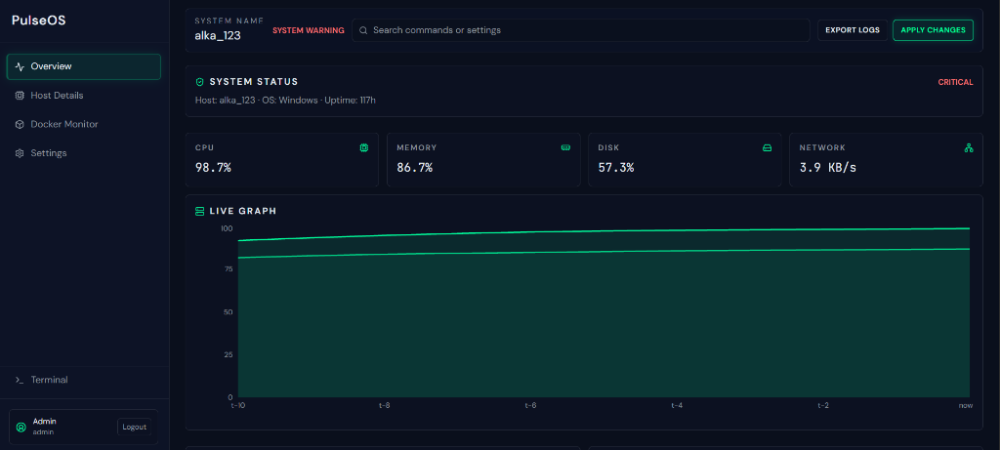
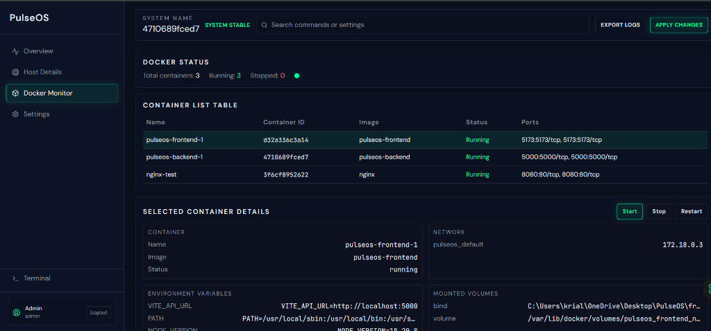
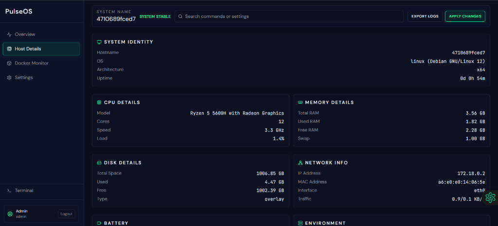
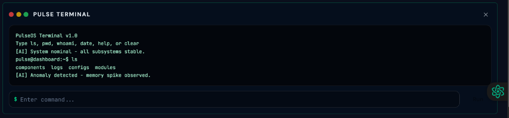
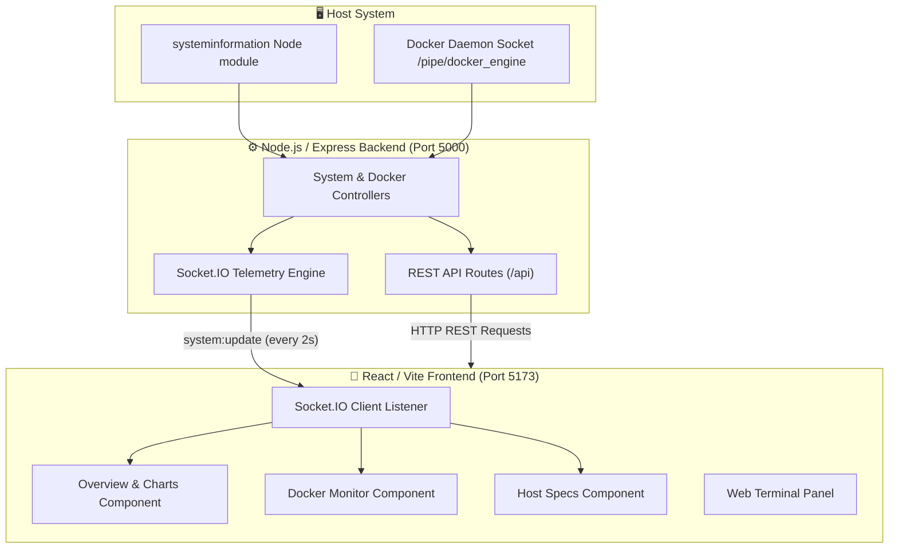

# ⚡ PulseOS — Smart Server Dashboard & System Monitor

[](https://nodejs.org/)
[](https://react.dev/)
[](https://vitejs.dev/)
[](https://tailwindcss.com/)
[](https://socket.io/)
[](https://www.docker.com/)
[](#-license)

**PulseOS** is a modern, real-time smart server dashboard and system activity monitoring platform built with **React**, **Node.js/Express**, **Socket.IO**, and **Dockerode**. It streams real-time telemetry from host servers directly to an intuitive, responsive web UI with live charts, container controls, host diagnostics, and an integrated web terminal.

---

## 🖼️ Project Screenshots

| Overview Dashboard | Docker Container Monitor |
| :---: | :---: |
|  |  |
| *Real-time CPU, RAM, Network throughput & Disk metrics* | *Live container stats & start/stop/restart management* |

| Host System Details | Integrated Web Terminal |
| :---: | :---: |
|  |  |
| *Detailed hardware specs, OS kernel, network interfaces* | *Browser CLI command runner and quick diagnostic search* |

---

## ✨ Features

- 📊 **Real-Time Telemetry & WebSockets**: Low-latency live metric streaming every 2 seconds powered by Socket.IO.
- 🖥️ **Interactive CPU & Memory Charts**: Smooth, high-precision visual graphs rendered with Recharts.
- 🐳 **Docker Container Management**: Inspect active/stopped containers, resource consumption (CPU/RAM), and perform start, stop, or restart operations directly from the dashboard.
- 💻 **Host Hardware Diagnostics**: Detailed inspection of host CPU architecture, multi-core speeds, memory allocation, storage partitions, and network interfaces.
- 📟 **Integrated Web Terminal**: Embedded CLI command center for server diagnostic commands and process tracking.
- 🔐 **Authentication & Security**: Protected dashboard routing with simple token-based session verification.
- ⚙️ **Customizable Settings**: Configurable telemetry refresh rates, alert thresholds, dark/light themes, and custom API server endpoints.
- 🐳 **Docker Compose Ready**: Full containerized development setup with hot-reloading for frontend and backend.

---

## 🏗️ Architecture & How It Works



1. **Telemetry Collection**: The backend uses `systeminformation` to gather live CPU usage, memory utilization, disk usage, and network traffic from the host operating system.
2. **Container Engine API**: Backend interfaces with Docker daemon via `dockerode` to monitor and manage Docker containers.
3. **WebSocket Broadcast**: Socket.IO pushes aggregated system snapshots to connected frontend clients every 2 seconds.
4. **Reactive UI Rendering**: React frontend updates dashboard widgets and Recharts graphs instantly without full-page reloads.

---

## 📁 Project Structure

```text
PulseOS/
├── backend/
│   ├── src/
│   │   ├── controllers/      # System, Docker, Command & Auth controllers
│   │   ├── middleware/       # Express error handler & auth middleware
│   │   ├── routes/           # REST API endpoints (/api/system, /api/docker, etc.)
│   │   ├── app.js            # Express application configuration
│   │   ├── server.js         # HTTP server entry point
│   │   └── socket.js         # Socket.IO WebSocket broadcaster
│   ├── Dockerfile            # Backend container manifest
│   └── package.json
│
├── frontend/
│   ├── src/
│   │   ├── components/       # Overview, DockerMonitor, HostDetails, TerminalPanel, Login
│   │   ├── config.js         # API and WebSocket URL configurations
│   │   ├── App.jsx           # React Router & protected layout setup
│   │   ├── index.css         # Tailwind & custom glassmorphism styles
│   │   └── main.jsx          # React DOM root entry point
│   ├── Dockerfile            # Frontend container manifest
│   ├── tailwind.config.js    # Tailwind theme customization
│   ├── vite.config.js        # Vite dev server configuration
│   └── package.json
│
├── docs/
│   └── screenshots/          # Dashboard screenshots & assets
├── docker-compose.yml        # Multi-container Compose orchestration
└── README.md
```

---

## 🛠️ Tech Stack

### Frontend
- **Framework**: [React 18](https://react.dev/) + [Vite](https://vitejs.dev/)
- **Styling**: [Tailwind CSS](https://tailwindcss.com/) + Custom Glassmorphism CSS
- **Charts**: [Recharts](https://recharts.org/)
- **Icons**: [Lucide React](https://lucide.dev/)
- **Real-Time Data**: [Socket.IO Client](https://socket.io/docs/v4/client-api/)
- **Routing**: [React Router DOM v7](https://reactrouter.com/)

### Backend
- **Runtime**: [Node.js](https://nodejs.org/) (v18+)
- **Server Framework**: [Express.js](https://expressjs.com/)
- **Real-Time Engine**: [Socket.IO](https://socket.io/)
- **System Metrics**: [systeminformation](https://systeminformation.io/)
- **Docker API**: [dockerode](https://github.com/apocas/dockerode)
- **CORS Management**: [cors](https://www.npmjs.com/package/cors)

---

## 🚀 Getting Started

### Prerequisites
Make sure you have the following installed on your machine:
- [Node.js](https://nodejs.org/) (v18 or higher)
- [npm](https://www.npmjs.com/) (v9 or higher)
- [Docker & Docker Compose](https://www.docker.com/) *(optional, for containerized run)*

---

### Option 1: Quickstart with Docker Compose (Recommended)

Run both backend and frontend with live reloading using a single command:

```bash
docker compose up --build
```

Access the applications:
- **Frontend Dashboard**: `http://localhost:5173`
- **Backend REST API**: `http://localhost:5000/api/health`

---

### Option 2: Manual Local Setup

#### 1. Clone the repository
```bash
git clone https://github.com/alka204/PulseOS.git
cd PulseOS
```

#### 2. Setup Backend Server
```bash
cd backend
npm install
npm run dev
```
> The backend server will start listening on `http://localhost:5000`.

#### 3. Setup Frontend Client
In a new terminal window:
```bash
cd frontend
npm install
npm run dev
```
> The frontend application will start on `http://localhost:5173`.

---

## 📡 API Endpoints Overview

| Method | Endpoint | Description |
| :--- | :--- | :--- |
| `GET` | `/api/health` | Health check endpoint returning server status |
| `POST` | `/api/auth/login` | Authenticate user and receive access token |
| `GET` | `/api/system/snapshot` | Get complete system metrics snapshot |
| `GET` | `/api/docker/containers` | Fetch list of Docker containers and their state |
| `POST` | `/api/docker/containers/:id/:action` | Control container state (`start`, `stop`, `restart`) |
| `POST` | `/api/command/exec` | Execute server diagnostic command (Protected) |

---

## ⚙️ Environment Variables

Create `.env` files in `backend` and `frontend` if custom overrides are needed.

### Backend (`backend/.env`)
```env
PORT=5000
NODE_ENV=development
```

### Frontend (`frontend/.env`)
```env
VITE_API_URL=http://localhost:5000
```

---

## 🔮 Future Enhancements

- 📈 Historical metrics persistence & timeline analytics.
- 🔔 Email & Webhook notifications for CPU/RAM threshold alerts.
- 🔑 Role-Based Access Control (RBAC) for terminal & Docker controls.
- 🌐 Multi-server node monitoring support.

---

## 👩‍💻 Author

**Alka Kumari**
- GitHub: [@alka204](https://github.com/alka204)
- Project: **PulseOS — Real-time Smart Server Dashboard**

---

## 📄 License

This project is licensed under the [MIT License](LICENSE).
